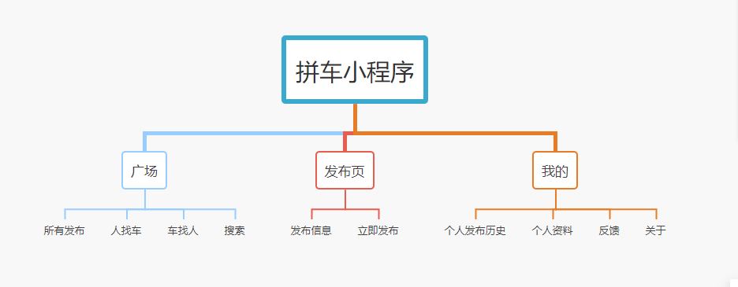
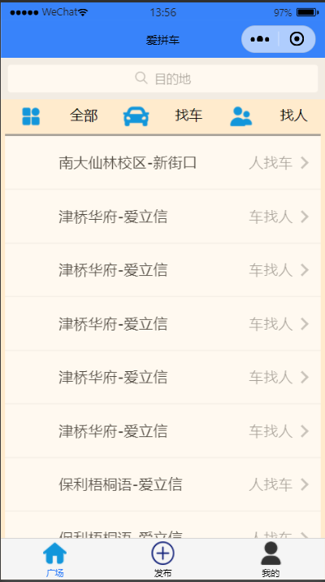
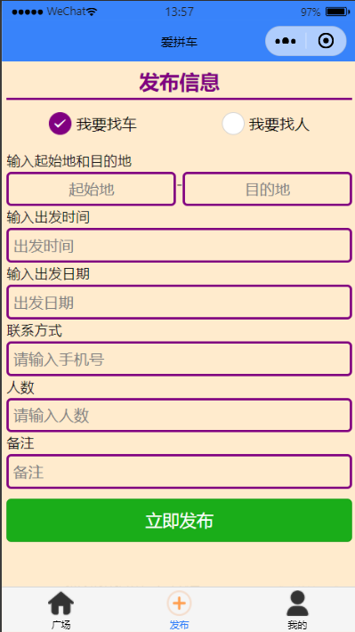

# 拼车小程序

> 需求与功能

 **用户故事：** 

&emsp;&emsp;现在越来越多的人开始拼车出行，方便、快捷。但是目前大部分都是通过微信群进行找车或者车找人。群里有时发布一些无关的信息，导致消息不能准确的让我门浏览到。此小程序简单的实现了发布人找车和车找人的功能，在首页可以看到用户们发布的信息，小程序主要功能是发布找人或者找车信息，与找车群比起来信息更加明了，不管您是找人还是找车，都可以了解大概的信息，然后联系对方，方便快捷。

---

> 页面设计与开发

 **页面规划：** 



- 广场
  - 用于展示发布信息
  - 通过目的地搜索信息
  - 通过车找人和人找车筛选信息
  - 点击信息进入详情也，点击马上联系即可自动跳转到拨号页面
  - 备注
- 发布
  - 发布信息
- 我的
  - 发布历史
  - 个人资料
  - 信息反馈
  - 关于

---

 **技术组合：** 

- 后端：SpringBoot  +  MyBatis  +  PageHelper   +  Druid
- 数据库：MySQL8.0
- 前端UI：微信小程序

`工具与环境：`

*  IDEA
*  Maven 3
*  JDK 11

---

> 框架搭建与配置

**引入Spring Boot模块：**

* web   ---》集成了Tomcat，spring  MVC

  ```java
  <dependency>
      <groupId>org.springframework.boot</groupId>
      <artifactId>spring-boot-starter-web</artifactId>
  </dependency>
  ```

  ---

* MySQL

  ```java
  <dependency>
      <groupId>mysql</groupId>
      <artifactId>mysql-connector-java</artifactId>
      <scope>runtime</scope>
  </dependency>
  ```

  ---

* MyBatis

  ```java
  <dependency>
      <groupId>org.mybatis.spring.boot</groupId>
      <artifactId>mybatis-spring-boot-starter</artifactId>
      <version>2.1.1</version>
  </dependency>
  ```

  ---

* DevTools

  ```java
  <dependency>
      <groupId>org.springframework.boot</groupId>
      <artifactId>spring-boot-devtools</artifactId>
      <scope>runtime</scope>
  </dependency>
  ```

- druid

```java
<dependency>
    <groupId>com.alibaba</groupId>
    <artifactId>druid-spring-boot-starter</artifactId>
    <version>1.1.21</version>
</dependency>
```

- pagehelper --》分页

```java
<!-- 分页 -->
<dependency>
    <groupId>com.github.pagehelper</groupId>
    <artifactId>pagehelper</artifactId>
    <version>5.1.10</version>
</dependency>
<dependency>
    <groupId>com.github.pagehelper</groupId>
    <artifactId>pagehelper-spring-boot-autoconfigure</artifactId>
    <version>1.2.13</version>
</dependency>
<dependency>
    <groupId>com.github.pagehelper</groupId>
    <artifactId>pagehelper-spring-boot-starter</artifactId>
    <version>1.2.12</version>
</dependency>
```

.......

<table><td bgcolor=#AEEEEE></td></table>

**application.yml配置**

```java
spring:
  datasource:
    type: com.alibaba.druid.pool.DruidDataSource
    driver-class-name: com.mysql.cj.jdbc.Driver
    username: root
    password: 123456
    url: jdbc:mysql://127.0.0.1:3306/findcar?useSSL=true&serverTimezone=UTC
  mail:
    host: smtp.qq.com
    username: 你自己的邮箱
    password: 输入你申请到的授权码
    default-encoding: UTF-8
    port: 465
    properties:
      mail:
        smtp:
          auth: true
          starttls:
            enable: true
            required: true
          socketFactory:
            class: "javax.net.ssl.SSLSocketFactory"
                
mybatis:
  mapper-locations: classpath:mapper/*.xml
  type-aliases-package: vip.huhailong.findcar.entity
  configuration:
    log-impl: org.apache.ibatis.logging.stdout.StdOutImpl
pagehelper:
  helper-dialect: mysql
  reasonable: true
  support-methods-arguments: true
  params: count=countSql
server:
  port: 8080
```

<table><td bgcolor=#AEEEEE></td></table>

`部分小程序界面：`





---